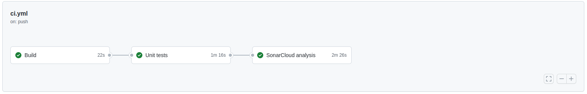

[](https://sonarcloud.io/dashboard?id=softwarejimenez_multithreading-socket)

# multithreading-socket

Java application that opens a socket and restricts input to at most 5 concurrent clients.

Clients will connect to the Application and write one or more numbers of 9 digits numbers, each number followed by a
server-native newline sequence, and then close the connection.

The Application must write a de- duplicated list of these numbers to a log file in no particular order.

## Requirements

1. The Application must accept input from at most 5 concurrent clients on TCP/IP port 4000.
2. Input lines presented to the Application via its socket must either be composed of exactly
   nine decimal digits (e.g.: 314159265 or 007007009) immediately followed by a newline.
3. Numbers presented to the Application must include leading zeros as necessary to
   ensure they are each 9 decimal digits.
4. The log file, to be named "numbers.log”, must be created anew and/or cleared when the Application starts.
5. Only numbers may be written to the log file.
6. No duplicate numbers may be written to the log file.
7. Any data that does not conform to a valid line of input should be discarded and the client
   connection terminated immediately and without comment.
8. Every 10 seconds, the Application must print a report to standard output:
    - The difference since the last report of the count of new unique numbers that have
      been received.
    - The difference since the last report of the count of new duplicate numbers that
      have been received.
    - The total number of unique numbers received for this run of the Application.
    - Example: "Received 50 unique numbers, 2 duplicates. Unique total: 567231"
9. If any connected client writes a single line with only the word "terminate",
   the Application must disconnect all clients and perform a clean shutdown as quickly as possible.

## Build, test

```
mvn clean install
```

## Running manually

- Running the server

```
mvn exec:java -Dexec.mainClass="org.example.Main"
```

- Running a client

```
telnet localhost 4000
    123456789
    terminate
```

- Check log file:

```
cat /tmp/numbers.log
```

## CI (Continues Integration)



- Using GitHub actions `.github/workflows/ci.yml`
- Each time there is a push into master branch:
  - Build 
  - Test
  - Static analysis with SonarCloud https://sonarcloud.io/project/overview?id=softwarejimenez_multithreading-socket

## TODO:

- [ ] Testing
    - Unit test
- [ ] Documentation
    - Create a siteMap of the status of the threads
    - Add screenshot of static analysis tool
    